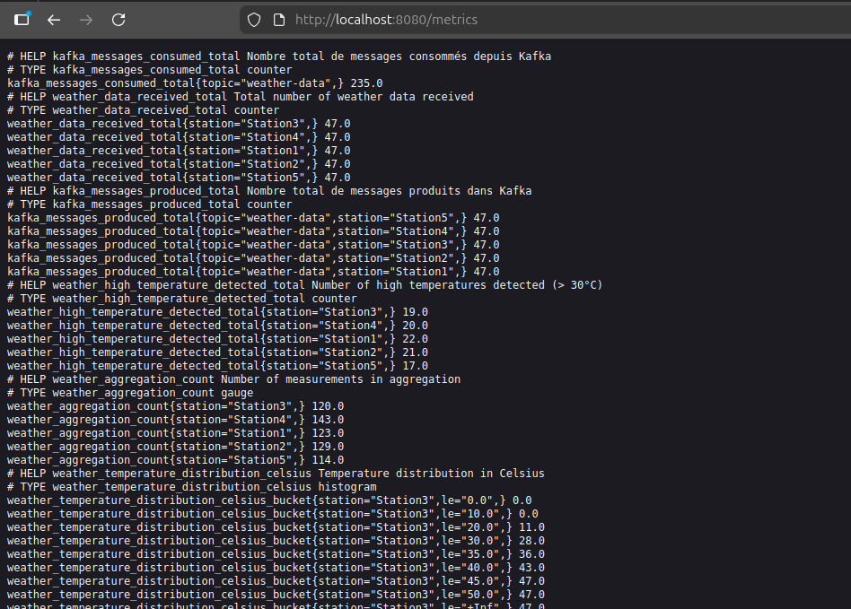
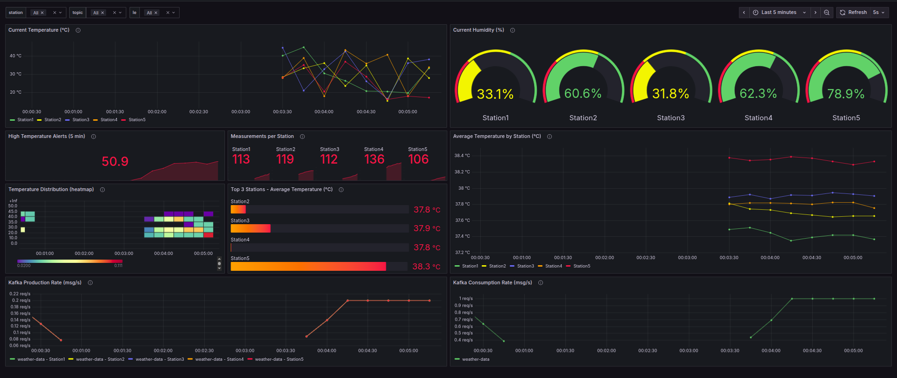

# Weather Data Analysis Platform

A real-time weather data analysis platform built with Apache Kafka Streams, featuring Prometheus metrics integration and Grafana visualization. The system processes streaming weather data, applies business logic filters, aggregates statistics by station, and provides comprehensive observability.

## Table of Contents

- [Overview](#overview)
- [Key Features](#key-features)
- [Architecture](#architecture)
- [Technology Stack](#technology-stack)
- [Prerequisites](#prerequisites)
- [Installation](#installation)
- [Configuration](#configuration)
- [Running the Application](#running-the-application)
- [Monitoring](#monitoring)

## Overview

This application demonstrates a complete streaming data pipeline using Kafka Streams for real-time weather analytics. It ingests synthetic time-series weather data from multiple stations, applies domain-specific filtering (temperature thresholds), computes rolling aggregations, and exposes operational metrics for monitoring.

**Use Cases:**

- Real-time weather monitoring systems
- IoT sensor data aggregation
- Time-series analytics pipelines
- Stream processing pattern demonstrations
- Microservices observability examples

## Key Features

### Core Functionality

- **Real-time Stream Processing**: Kafka Streams topology with stateful aggregations
- **Temperature Filtering**: Business logic filter for temperatures exceeding 30°C
- **Station-based Aggregation**: Continuous calculation of average temperature and humidity per weather station
- **Dual Output**: Results published to Kafka topic and console for debugging
- **Time-series Generation**: Built-in synthetic data generator for testing and demonstrations

### Operational Excellence

- **Prometheus Integration**: Comprehensive metrics exposed on HTTP endpoint
- **Grafana Dashboards**: Pre-built visualization with 12 panels covering app health, data quality, and Kafka performance
- **Health Monitoring**: Application health checks with status metrics
- **Validation Layer**: Input data validation with configurable temperature ranges (-100°C to 100°C)
- **Graceful Shutdown**: Clean resource cleanup on application termination
- **Singleton Configuration**: Centralized configuration management via AppConfig

### Code Quality

- **Comprehensive Testing**: 19 JUnit tests covering models, validation, and configuration
- **Custom Serialization**: Jackson-based JSON SerDes for Kafka messages
- **Structured Logging**: SLF4J with configurable log levels
- **Maven Build System**: Standard project structure with dependency management
- **Professional Codebase**: Clean code, no decorative output, fully English

## Architecture

### System Overview

```
┌──────────────────────┐
│ WeatherDataGenerator │  Produces synthetic data every 5s
│   (Kafka Producer)   │
└──────────┬───────────┘
           │ CSV: "Station1,35.5,60"
           ↓
    ┌──────────────┐
    │ weather-data │  Input Topic (3 partitions)
    └──────┬───────┘
           │
           ↓
┌──────────────────────────────┐
│  WeatherStreamsProcessor     │
│  ┌────────────────────────┐  │
│  │ 1. Parse CSV → Object  │  │
│  │ 2. Validate Data       │  │
│  │ 3. Filter (temp > 30°C)│  │
│  │ 4. Group by Station    │  │
│  │ 5. Aggregate Stats     │  │
│  └────────────────────────┘  │
└──────────┬───────────────────┘
           │
           ↓
    ┌──────────────────┐
    │ station-averages │  Output Topic (3 partitions)
    └──────┬───────────┘
           │
           ├─────────────────────┐
           │                     │
           ↓                     ↓
    ┌──────────┐         ┌─────────────┐
    │ Console  │         │ Prometheus  │
    │  Logs    │         │  Metrics    │
    └──────────┘         └──────┬──────┘
                                │
                                ↓
                         ┌──────────────┐
                         │   Grafana    │
                         │  Dashboard   │
                         └──────────────┘
```

### Processing Pipeline

The Kafka Streams topology implements the following data flow:

1. **Ingestion**: KStream consumes from weather-data topic
2. **Parsing**: CSV string converted to WeatherData object
3. **Validation**: Temperature and humidity values validated
4. **Filtering**: Only temperatures > 30°C pass through
5. **Grouping**: Records grouped by station name (KGroupedStream)
6. **Aggregation**: Stateful aggregation computes running averages (KTable)
7. **Output**: Results serialized and published to station-averages topic
8. **Observability**: Metrics recorded at each stage

## Technology Stack

### Core Technologies

- **Java 21**: Language platform with modern features
- **Apache Kafka Streams 4.1.0**: Stream processing framework
- **Apache Kafka 3.9.0**: Distributed streaming platform (Docker)
- **Maven**: Build automation and dependency management

### Monitoring & Observability

- **Prometheus Client 0.16.0**: Metrics collection and exposition
- **Grafana**: Metrics visualization and alerting
- **SLF4J 2.0.9**: Logging facade
- **Simple Logger**: Lightweight logging implementation

### Serialization & Testing

- **Jackson 2.15.3**: JSON serialization/deserialization
- **JUnit 5.10.1**: Unit testing framework

### Infrastructure

- **Docker**: Kafka broker containerization
- **Bash**: Automation scripts for topic management

## Prerequisites

- **Java Development Kit**: Version 21 or higher
- **Apache Maven**: Version 3.6+ for building the project
- **Docker & Docker Compose**: For running Kafka broker

## Installation

### 1. Clone the Repository

```bash
git clone https://github.com/4bdex/weather-data-analysis.git
```

### 2. Start Kafka Infrastructure

Start Kafka broker using Docker Compose:

```bash
docker-compose up -d
```

Verify Kafka is running:

```bash
docker ps | grep broker
```

### 3. Create Kafka Topics

Use the provided script to create required topics:

```bash
./setup-topics.sh
```

This creates:

- weather-data: Input topic (3 partitions, replication factor 1)
- station-averages: Output topic (3 partitions, replication factor 1)

Alternatively, create topics manually:

```bash
docker exec broker kafka-topics --create \
  --bootstrap-server localhost:9092 \
  --topic weather-data \
  --partitions 3 \
  --replication-factor 1

docker exec broker kafka-topics --create \
  --bootstrap-server localhost:9092 \
  --topic station-averages \
  --partitions 3 \
  --replication-factor 1
```

### 4. Build the Application

```bash
cd meteo-data-analysis
mvn clean package
```

Build output: target/meteo-data-analysis-1.0-SNAPSHOT.jar

## Configuration

### Application Properties

Configuration file: src/main/resources/application.properties

```properties
# Kafka Configuration
kafka.bootstrap.servers=localhost:9092
kafka.application.id=weather-analysis-app
kafka.input.topic=weather-data
kafka.output.topic=station-averages

# Processing Configuration
temperature.threshold.celsius=30.0
temperature.validation.min=-100.0
temperature.validation.max=100.0

# Monitoring Configuration
prometheus.port=8080
health.check.interval.ms=5000

# Data Generation
generator.interval.seconds=5
generator.stations=Station1,Station2,Station3
```

### AppConfig Singleton

The AppConfig class provides centralized access to configuration:

```java
AppConfig config = AppConfig.getInstance();
String bootstrapServers = config.getKafkaBootstrapServers();
double threshold = config.getTemperatureThresholdCelsius();
int prometheusPort = config.getPrometheusPort();
```

## Running the Application

### Standard Execution

```bash
java -jar target/meteo-data-analysis-1.0-SNAPSHOT.jar
```

### Application Startup Sequence

1. **Initialization**: Loads configuration from application.properties
2. **Prometheus Server**: Starts HTTP server on port 8080
3. **Kafka Streams**: Initializes topology and starts processing
4. **Health Check**: Begins periodic health monitoring
5. **Data Generator**: Starts producing synthetic weather data every 5 seconds
6. **Console Output**: Displays aggregated results in real-time

### Expected Console Output

```
Starting Prometheus Metrics Server...
Prometheus metrics server started on port 8080

Starting Kafka Streams Processor...
Kafka Streams processor started successfully

Starting Weather Data Generator...
Generating initial data batch...
Starting continuous data generation (every 5 seconds)...

Application is running!
Watch the console for aggregated results.

Prometheus metrics: http://localhost:8080/metrics
Grafana dashboard: http://localhost:3000 (admin/admin)

Press ENTER to stop the application

Station2 : Average Temperature = 32.5°C, Average Humidity = 55.0% (Count: 1)
Station1 : Average Temperature = 35.0°C, Average Humidity = 60.0% (Count: 2)
Station3 : Average Temperature = 31.2°C, Average Humidity = 50.0% (Count: 1)
```

### Graceful Shutdown

Press **ENTER** or **Ctrl+C** to stop:

```
Stopping application...
Application stopped successfully
```

### Makefile Commands

The project includes a comprehensive Makefile for common operations. Run `make help` to see all available commands:

#### Build & Test Commands

```bash
make build              # Build the project (skip tests)
make test               # Run unit tests
make test-coverage      # Run tests with coverage report
make clean              # Clean build artifacts
make compile            # Compile without packaging
make full-rebuild       # Clean, build, and test
```

#### Docker & Infrastructure Commands

```bash
make docker-up          # Start Kafka, Prometheus, Grafana
make docker-down        # Stop all Docker containers
make docker-logs        # View Docker container logs
make docker-ps          # Show running containers
make setup-topics       # Create required Kafka topics
```

#### Application Commands

```bash
make run                # Run the application
make run-dev            # Build and run
make quick-start        # Complete setup: docker-up + setup-topics + build + run
```

#### Monitoring Commands

```bash
make metrics            # Fetch Prometheus metrics from app
make health             # Check application health status
make prometheus         # Open Prometheus UI in browser
make grafana            # Open Grafana UI in browser
make status             # Show complete system status
```

#### Kafka Commands

```bash
make monitor                    # Interactive topic monitor
make kafka-console-consumer     # Start console consumer for weather-data
make kafka-console-producer     # Start console producer for testing
make kafka-topics-list          # List all Kafka topics
make kafka-reset                # Delete and recreate topics
```

#### Development Commands

```bash
make deps               # Display dependency tree
make update-deps        # Check for dependency updates
make install            # Install to local Maven repository
make lint               # Check code style (if configured)
make format             # Format code (if configured)
```

#### Quick Reference

**Complete setup from scratch:**

```bash
make quick-start
```

**Daily development workflow:**

```bash
make docker-up          # Start infrastructure
make build              # Build after code changes
make test               # Verify tests pass
make run                # Run application
```

**Check everything is working:**

```bash
make status             # System overview
make health             # Application health
make metrics            # View metrics
```

## Monitoring

### Prometheus Metrics




Metrics endpoint: http://localhost:8080/metrics

#### Application Metrics

| Metric Name                              | Type      | Labels  | Description                                  |
| ---------------------------------------- | --------- | ------- | -------------------------------------------- |
| weather_current_temperature_celsius      | Gauge     | station | Current temperature reading per station (°C) |
| weather_current_humidity_percent         | Gauge     | station | Current humidity reading per station (%)     |
| weather_avg_temperature_celsius          | Gauge     | station | Rolling average temperature per station (°C) |
| weather_avg_humidity_percent             | Gauge     | station | Rolling average humidity per station (%)     |
| weather_temperature_distribution_celsius | Histogram | station | Temperature distribution with buckets        |
| weather_aggregation_count                | Counter   | station | Total number of aggregated records           |
| weather_high_temperature_detected_total  | Counter   | station | Count of temperatures > 30°C                 |
| kafka_messages_produced_total            | Counter   | topic   | Total messages produced to Kafka             |
| kafka_messages_consumed_total            | Counter   | topic   | Total messages consumed from Kafka           |
| app_health_status                        | Gauge     | none    | Application health (1=healthy, 0=unhealthy)  |


### Grafana Dashboard

#### Setup

1. **Access Grafana**: Open http://localhost:3000 (credentials: admin/admin)
2. **Add Data Source**: Configuration → Data Sources → Add Prometheus
   - URL: http://prometheus:9090 (Docker) or http://localhost:9090 (local)
3. **Import Dashboard**: Dashboards → Import → Upload Weather_Analytics.json

#### Dashboard Panels



**Weather Analytics Section:**

1. Average Temperature by Station
2. Average Humidity by Station
3. Temperature Distribution
4. Current Temperature
5. Current Humidity
6. High Temperature Alerts

**Kafka Metrics Section:** 7. Messages Produced 8. Messages Consumed 9. Aggregation Count

### Monitoring Commands

View raw metrics:

```bash
curl http://localhost:8080/metrics
```

Monitor Kafka topics:

```bash
./monitor-topics.sh
```
